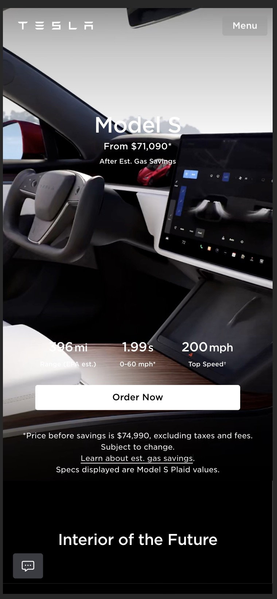

## Jij

  
uitwerken voor kick-off werkgroep

  ### Auteur:
  Dante Piekart

  #### Je startniveau:
  Zwart

  #### Je focus:
  Surface plane
 

## Je website

  
uitwerken voor kick-off werkgroep

  ### Je opdracht:
  Tesla

  #### Screenshot(s) van de eerste pagina (small screen): 
  Tesla Model S Product Page
  

  #### Screenshot(s) van de tweede pagina (small screen):
  Tesla Model S Order Page
  
 

## Toegankelijkheidstest 1/2 (week 1)

  
uitwerken na test in 2e werkgroep

  ### Bevindingen
  De screen reader leest de website goed voor.
  Alleen de animaties lopen een beetje vast op het moment dat de screenreader naar beneden wilt scrollen.
  Sommige stukken stekst staan genest in andere kopjes waardoor de screen reader soms de zelfde stuk tekst twee keer leest.

## Breakdownschets (week 1)

  
uitwerken na afloop 3e werkgroep

  ### Model S Product Page:
  

  ### Order Model S:
  

## Voortgang 1 (week 2)

  
uitwerken voor 1e voortgang

  ### Stand van zaken
  Tijdens de lessen heb ik feedback gekregen op mijn html code. Ik gebruikte veel divs, had geen nav,ul en li, en had geen alt's bij mijn img tags. Dit had ik echter nog niet geimplementeerd. Ik wilde mij eerst focusen op de structuur en wilde daarna focusen op de details in de elementen.

## Voortgang 2 (week 3)

  
uitwerken voor 2e voortgang

  ### Stand van zaken
  Ik heb besloten in deze week mijn aanpak aan te passen. Ik had eerst besloten om mijn website responsive te maken. Echter heb ik niet goed gelet op mijn programmeren en na de ontdekking dat de verschillen tussen de mobile en desktop website van Tesla te groot zijn heb ik besloten om te gaan voor de surface plane.
  De Tesla website zit vol met kleine micro interacties, animaties, en andere kleine javascript ellementen, dus de surface plane moet een goede toevoeging zijn voor mijn werk.

## Toegankelijkheidstest 2/2 (week 4)

  
uitwerken na test in 9e werkgroep

  ### Bevindingen
  Tijdens de toegankelijkheids test heb ik de screenreader gebruikt om mijn website te testen. De test was succesvol. Alle elementen worden duidelijk voorgelezen en de screenreader skipt geen elementen en leest geen element dubbel voor. Foto's en knoppen worden duidelijk toegelicht.

## Voortgang 3 (week 4)

  
uitwerken voor 3e voortgang

  ### Stand van zaken
  Deze week heb ik weinig kunnen werken aan mijn website door prive omstandigheden.

## Eindgesprek (week 5)

  
uitwerken voor eindgesprek

  ### Dit ging goed/Heb ik geleerd: 
  De html als css was mij goed gellukt, de opbouw en streuctuur ziet er netjes uit. Alleen door tijd tekort heb ik jammergenoeg niet kunnen werken aan de surface plane en de tweede pagina.

  

  ### Dit was lastig/Is niet gelukt:
  Het moeilijkste was om de css goed op orde te krijgen. Veel elementen werden hergebruikt op de website maar met kleine aanpassingen. Hierdoor moest ik voor elk component naast de hergebruikte code ook nog extra code schrijven.

## Herkansing

  
uitwerken voor eindgesprek

  ### Dit ging goed/Heb ik geleerd: 
  Voor de herkansing is het mij gellukt alles af te maken. Beide pagina's zijn netjes uitgewerkt met html en css en de screenreader heeft geen moeite om de pagina's goed voor te lezen.

  
  

  ### Dit was lastig/Is niet gelukt:
De javascript was in het begin wat lastig. De DOM injection op de order pagina was vrij nieuw voor mij en ik had paar pogingen nodig om de code goed op orde te krijgen. Zelfs nu is de code nog niet perfect. Als je de knoppen voor purchase price en probable savings gebruikt, stopt de rest van de code.

## Bronnenlijst

  1. ChatGPT
  2. [Fade in on scroll vanilla Javascript](https://codepen.io/bstonedev/pen/MWWZgKz)
  3. [CSS Glass](https://css.glass/)

